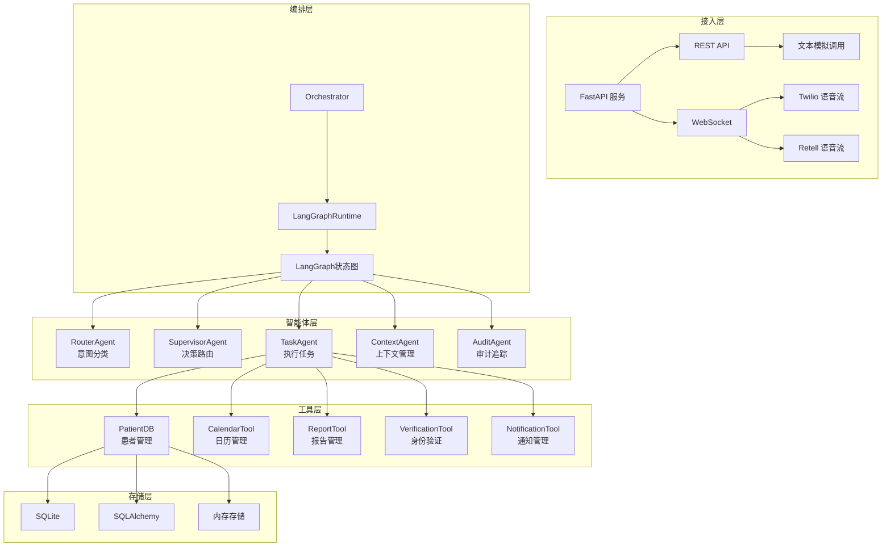
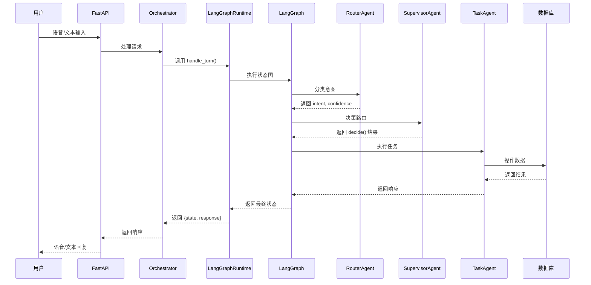

# ClinicVoxAI 项目全面解析

## 一、项目需求分析

### 核心需求
- **智能语音客服**：通过语音交互处理患者预约、取消、改期等操作
- **患者身份认证**：安全验证患者身份，保护隐私
- **医疗报告管理**：提供医疗报告查询和摘要
- **多渠道接入**：支持 Twilio、Retell 等多种语音流接入
- **可靠性保障**：错误处理、故障注入、监控告警

### 业务场景
- **预约管理**：新患者注册、预约挂号、改期、取消
- **报告查询**：医疗报告获取、摘要生成
- **身份验证**：基于手机号和出生日期的双因素验证
- **客服分流**：智能路由和转人工机制

## 二、系统设计方案

### 1. 架构设计

### 2. 核心流程图

## 三、技术栈

| 分类 | 技术/框架 | 用途 | 来源 |
|------|-----------|------|------|
| **后端框架** | FastAPI | 提供 REST API 和 WebSocket 接口 | [main.py](file:///Users/jinniu/Documents/GitHub/ClinicVoxAI/app/main.py) |
| **状态管理** | LangGraph | 智能体协作和状态流转 | [langgraph_flow.py](file:///Users/jinniu/Documents/GitHub/ClinicVoxAI/app/graph/langgraph_flow.py) |
| **数据库** | SQLite | 轻量级本地存储 | [db_sqlite.py](file:///Users/jinniu/Documents/GitHub/ClinicVoxAI/app/tools/db_sqlite.py) |
| | SQLAlchemy | ORM 框架，支持多数据库 | [db_sqlalchemy.py](file:///Users/jinniu/Documents/GitHub/ClinicVoxAI/app/tools/db_sqlalchemy.py) |
| **语音处理** | OpenAI STT/TTS | 语音转文字/文字转语音 | [openai_stt.py](file:///Users/jinniu/Documents/GitHub/ClinicVoxAI/app/voice/openai_stt.py) |
| | Twilio | 电话语音流处理 | [twilio_stream.py](file:///Users/jinniu/Documents/GitHub/ClinicVoxAI/app/voice/twilio_stream.py) |
| | Retell | 语音流处理 | [retell_stream.py](file:///Users/jinniu/Documents/GitHub/ClinicVoxAI/app/voice/retell_stream.py) |
| **监控告警** | 自定义监控 | 系统健康检查和告警 | [alerts.py](file:///Users/jinniu/Documents/GitHub/ClinicVoxAI/app/monitoring/alerts.py) |
| **容错机制** | 故障注入 | 测试系统容错能力 | [fault_injection.py](file:///Users/jinniu/Documents/GitHub/ClinicVoxAI/app/fault_injection.py) |
| **工具集成** | 日历工具 | 预约管理 | [calendar.py](file:///Users/jinniu/Documents/GitHub/ClinicVoxAI/app/tools/calendar.py) |
| | 通知工具 | 短信通知 | [notifications.py](file:///Users/jinniu/Documents/GitHub/ClinicVoxAI/app/tools/notifications.py) |
| | 验证工具 | 身份验证 | [verification.py](file:///Users/jinniu/Documents/GitHub/ClinicVoxAI/app/tools/verification.py) |

## 四、实现过程

### 1. 系统初始化
- **配置加载**：从 [config.py](file:///Users/jinniu/Documents/GitHub/ClinicVoxAI/app/config.py) 加载系统配置
- **Agent 构建**：通过 [agent_registry.py](file:///Users/jinniu/Documents/GitHub/ClinicVoxAI/app/graph/agent_registry.py) 构建智能体
- **LangGraph 初始化**：构建状态图和执行流程

### 2. 智能体协作流程
1. **RouterAgent**：识别用户意图和患者类型
2. **SupervisorAgent**：根据置信度和错误次数决策路由
3. **TaskAgent**：执行具体业务任务
4. **状态传递**：SessionState 在智能体间传递和更新

### 3. 核心功能实现
- **患者注册**：收集个人信息，生成 patient_id，初始化医疗报告
- **身份验证**：基于手机号和出生日期的双因素验证
- **预约管理**：获取可用时段，预约/改期/取消
- **报告管理**：查询医疗报告，生成摘要

### 4. 语音流处理
- **Twilio 集成**：处理电话语音流
- **Retell 集成**：处理实时语音流
- **OpenAI 实时API**：提供语音交互能力

## 五、核心价值

### 1. 智能体协作机制
- **LangGraph 状态图**：实现智能体间的有序协作
- **条件路由**：基于置信度的智能决策
- **状态管理**：统一的状态传递和更新机制

### 2. 多渠道接入
- **REST API**：文本模拟调用
- **WebSocket**：实时语音流处理
- **多平台支持**：Twilio、Retell、OpenAI

### 3. 可靠性设计
- **故障注入**：主动测试系统容错能力
- **错误处理**：详细的错误追踪和转人工机制
- **监控告警**：系统健康状态监控

### 4. 安全认证
- **双因素验证**：手机号 + 出生日期
- **尝试次数限制**：防止暴力破解
- **状态隔离**：验证状态的完整追踪

### 5. 可扩展性
- **存储后端**：支持 SQLite、SQLAlchemy、内存存储
- **路由后端**：支持规则、LLM、OpenAI 分类
- **模块化设计**：易于添加新功能和集成新服务

## 六、其他重要特性

### 1. 事件追踪与审计
- **EventRecorder**：记录所有状态变更和事件
- **状态差异追踪**：记录智能体执行前后的状态变化
- **审计日志**：支持后续分析和调试

### 2. 性能监控
- **节点执行时间**：记录每个智能体的执行时长
- **系统健康检查**：提供健康状态接口
- **告警机制**：关键操作失败时触发告警

### 3. 测试工具
- **模拟调用**：支持文本模拟整个流程
- **故障注入**：测试系统在故障下的表现
- **评估工具**：评估智能体性能和路由准确性

### 4. 开发工具
- **演示脚本**：多种场景的演示脚本
- **追踪可视化**：生成执行流程的可视化图表
- **代码质量**：结构化的代码组织和类型注解

## 七、项目亮点总结

1. **完整的语音AI解决方案**：从语音输入到业务处理的全流程支持
2. **智能体协作架构**：基于 LangGraph 的多智能体协作系统
3. **多渠道接入**：支持多种语音平台和交互方式
4. **可靠性设计**：完善的错误处理和故障注入机制
5. **安全认证**：基于双因素的患者身份验证
6. **可扩展性**：模块化设计，支持多种后端存储
7. **监控与审计**：完整的事件追踪和性能监控
8. **开发友好**：丰富的测试和开发工具

ClinicVoxAI 项目展示了如何构建一个完整的语音智能客服系统，通过多智能体协作和现代技术栈，实现了医疗场景下的智能预约、报告查询等功能，为医疗服务的数字化转型提供了有力支持。