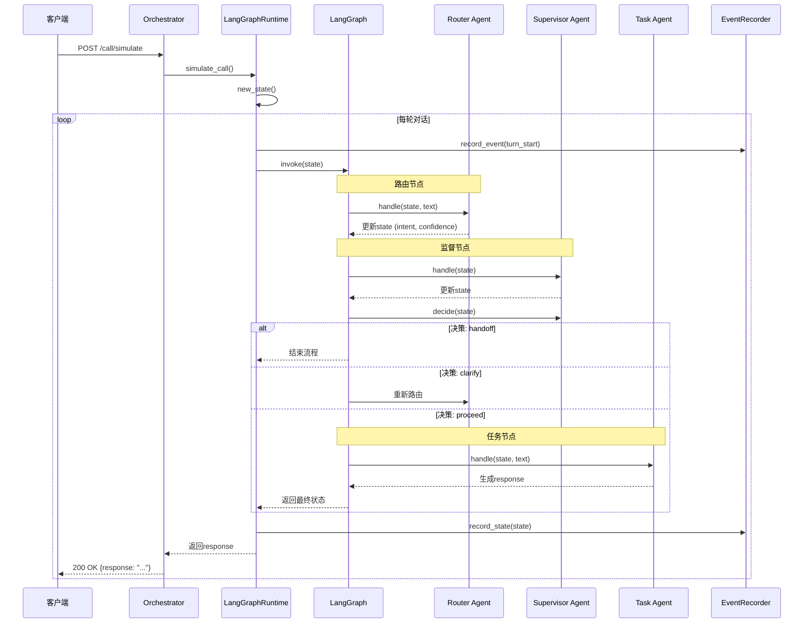

          
# 多 Agent 交互核心时序图

## 核心组件

| 组件 | 职责 |
|------|------|
| **Orchestrator** | 编排器，提供外部接口 |
| **LangGraphRuntime** | LangGraph 运行时，管理整个流程 |
| **LangGraphOrchestrator** | 构建 LangGraph 流程图 |
| **Router Agent** | 意图分类、患者类型识别 |
| **Supervisor Agent** | 质量监控、决策（继续/澄清/转人工） |
| **Task Agent** | 执行具体任务（预约、报告等） |
| **EventRecorder** | 事件记录、状态追踪 |

## 交互时序图



## 详细流程说明

### 1. 启动流程
1. **Orchestrator 初始化**：创建 LangGraphRuntime 实例
2. **LangGraphRuntime 初始化**：
   - 构建所有 Agent
   - 创建 EventRecorder
   - 构建 LangGraph 流程图

### 2. 每轮对话处理
1. **接收输入**：客户端发送 `/call/simulate` 请求
2. **状态准备**：创建或更新 SessionState
3. **事件记录**：记录 turn_start 事件
4. **LangGraph 执行**：
   - **Router 节点**：分类意图，更新状态
   - **Supervisor 节点**：评估置信度，做出决策
   - **Task 节点**：执行具体任务，生成响应
5. **状态更新**：记录状态变化
6. **返回响应**：返回处理结果给客户端

### 3. 决策逻辑
- **handoff**：转人工（置信度过低或错误过多）
- **clarify**：澄清意图（置信度不高）
- **proceed**：继续执行任务（置信度足够）

### 4. 事件追踪
- 记录每轮对话开始/结束
- 记录状态变化
- 记录节点执行时长
- 导出完整的执行轨迹

## 技术特点

1. **基于 LangGraph**：使用 LangGraph 框架编排 Agent 流程
2. **状态管理**：使用 SessionState 统一管理对话状态
3. **事件追踪**：详细记录所有事件和状态变化
4. **可扩展性**：模块化设计，易于添加新 Agent
5. **决策树**：基于条件的分支处理

## 执行流程示例

```
客户端输入 → Orchestrator.simulate_call() → LangGraphRuntime.handle_turn() → LangGraph.invoke()
→ Router.handle() → Supervisor.handle() → Supervisor.decide() → Task.handle() → 返回响应
```

这个设计实现了一个灵活的多 Agent 协作系统，通过 LangGraph 提供的状态管理和流程编排能力，实现了复杂的对话处理逻辑。