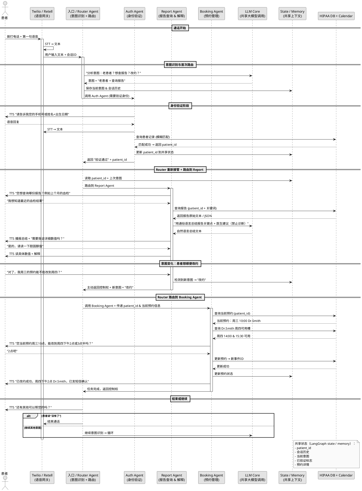

以下是为您的 **ClinicVoxAI** 项目（语音智能诊所客服系统）绘制的**多Agent交互核心时序图**，重点描述典型的多轮对话中 **Agent之间信息交互与协作过程**。

我使用 **PlantUML** 语法提供（可直接复制到 plantuml.com/plantuml 或任意支持PlantUML的工具渲染成图片）。这个图聚焦于**多Agent协作**的本质，而不是单纯的单次意图处理。

### 多Agent协作典型场景：老患者来电 → 验证 → 查询报告 → 需要改约 → 最终确认（涉及多个Agent协作）



### 这个时序图的核心信息交互过程说明

1. **Router Agent 是中央协调者**（类似 Supervisor / Orchestrator）  
   - 负责首次意图识别  
   - 根据当前状态 + 用户最新输入决定调用哪个子Agent  
   - 子Agent完成后把控制权还给Router（或直接结束）

2. **子Agent 之间不直接调用彼此**（松耦合）  
   - 通过 **共享 State / Memory** 传递关键信息（patient_id、意图历史、预约详情等）  
   - 这符合 LangGraph 的典型设计：state 是全局可读写的“黑板”

3. **信息流向总结**  
   - 用户 → Twilio(STT) → Router → 子Agent  
   - 子Agent → LLM（解释/总结） → Backend（查/改数据） → 子Agent → 用户(TTS)  
   - 子Agent 完成 → 返回 Router（或状态变更触发新路由）  
   - Router → 下一个子Agent 或 结束

4. **典型协作模式**  
   - **顺序协作**：验证 → 报告 → 改约  
   - **动态跳转**：Report Agent 检测到改约意图 → 主动让出控制权给 Router  
   - **状态驱动**：所有决定基于共享 state，而不是硬编码顺序

如果您使用的是 LangGraph，这个图几乎可以直接对应到 graph 的 node（每个Agent是一个node）和 edge（router 的条件分支）。

需要调整为更偏向 **CrewAI**（角色+任务委派）或 **AutoGen**（group chat 风格）的交互方式吗？或者想聚焦某个具体子流程（如只看报告解释时的多Agent调用），我可以再画一张更细的。


# 完整多Agent协作流程图


```plantuml
@startuml
skinparam monochrome true
skinparam shadowing false
skinparam ActivityBorderThickness 2
skinparam ActivityFontSize 14
skinparam ArrowThickness 2

title ClinicVoxAI: 完整多Agent协作流程图 (Activity Diagram)

start
:患者拨打电话;
-> Twilio/Retell 捕获语音;

partition "Router Agent (入口协调)" {
  :STT 转文本;
  :调用 LLM 识别意图;
  if (新患者?) then (是)
    :路由到 Register Agent;
  else (否)
    :路由到 Auth Agent;
  endif
}

partition "Auth Agent (身份验证)" {
  :询问验证信息 (手机号/姓名+生日);
  :后端查询匹配;
  if (验证成功?) then (是)
    :更新共享 State (patient_id);
    :返回 Router;
  else (否)
    :重试或转人工;
    kill
  endif
}

partition "Register Agent (新患者注册)" {
  :播放 HIPAA 隐私声明;
  :收集基本信息 (姓名/生日/保险等);
  :存储到后端 DB (加密PHI);
  :生成 patient_id;
  :更新共享 State;
  :返回 Router;
}

-> Router 重新评估意图 (基于 State + 新输入);

fork
  partition "Report Agent (报告查询)" {
    :询问报告类型/时间;
    :后端查询报告 (patient_id);
    :LLM 通俗解释 (避免诊断);
    :TTS 播报总结;
    :处理追问;
    if (新意图检测?) then (如改约)
      :返回控制权给 Router;
    endif
  }
fork again
  partition "Booking Agent (预约管理)" {
    :查询当前预约 (patient_id);
    :后端查日历可用槽;
    :TTS 选项播报;
    :患者选择确认;
    :更新日历 + DB;
    :发送短信确认;
    if (新意图检测?) then (如查报告)
      :返回控制权给 Router;
    endif
  }
end fork

-> Router 检查会话结束?;
if (结束?) then (是)
  :TTS 道别;
  :结束通话;
else (否)
  :继续监听新输入;
  -> 循环到意图识别;
endif

stop

note bottom
  关键协作机制:
  - Router 作为中心, 动态路由
  - 共享 State: patient_id, 意图历史, 会话上下文
  - Agent间: 通过 Router/State 间接协作, 支持意图切换
  - 异常: 任意点可转人工 (未画出)
end note

@enduml
```

